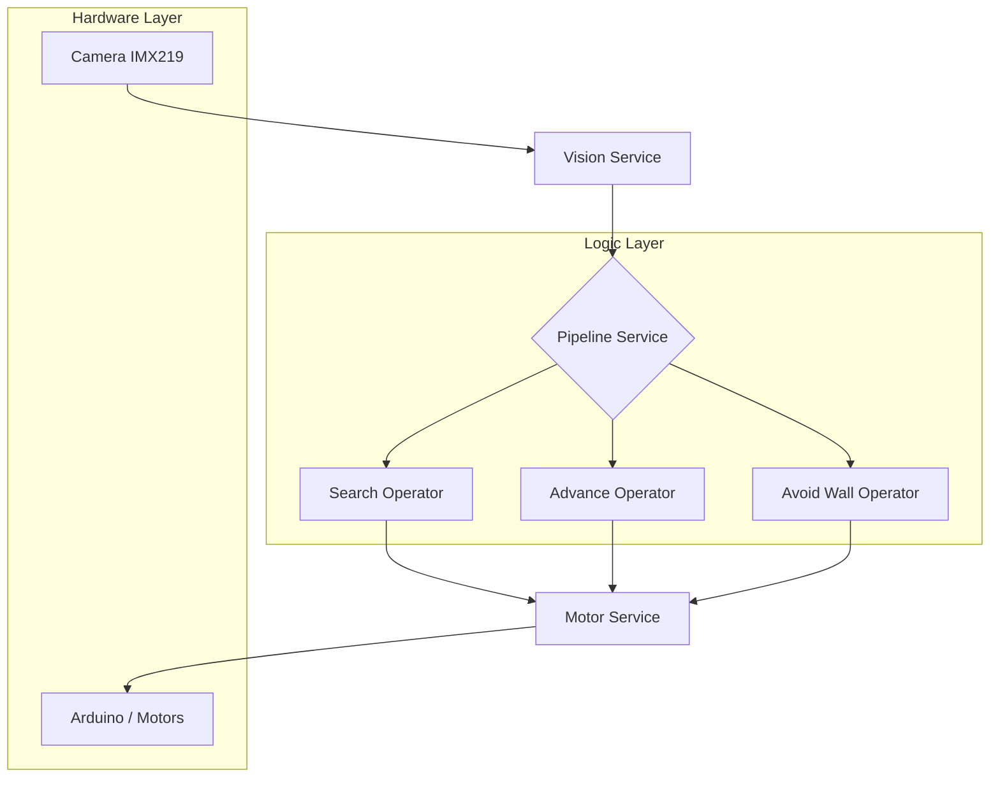

# ⚽ FutBot: Sistema Autónomo de Robótica Deportiva


**FutBot** es un proyecto de robótica avanzada diseñado para la competición de fútbol autónomo. Utiliza una arquitectura modular basada en **Pipelines** y **Operadores**, integrando visión artificial de vanguardia (YOLO + Filtros HSV) con control de motores de alta precisión sobre una Raspberry Pi 5.

---

## 🚀 Características Principales

- **Visión Híbrida Inteligente**: Combinación de YOLO para detección de objetos y filtros de color HSV/Saturación para eliminar falsos positivos (pilares amarillos, reflejos).
- **Arquitectura Modular**: Inspirada en patrones de diseño modernos, permitiendo el desacoplamiento entre la lógica de visión, el control de motores y la toma de decisiones.
- **Control de Estados (FSM)**: Implementación de una Máquina de Estados Finitos robusta para comportamientos de búsqueda (`SEARCH`), persecución (`ADVANCE`) y evasión (`AVOID`).
- **Seguridad Integrada**: Capa de detección de obstáculos y paredes para prevenir colisiones mediante sensores ultrasónicos y análisis de imagen.
- **Optimizado para Pi 5**: Aprovecha la potencia de la Raspberry Pi 5 y la cámara IMX219 con aceleración GStreamer.

---

## 🏗️ Arquitectura del Sistema

El sistema se divide en servicios y operadores que interactúan en un ciclo de ejecución continuo (Tick).



### Tabla de Especificaciones Técnicas

| Componente | Especificación | Función |
| :--- | :--- | :--- |
| **Controlador** | Raspberry Pi 5 | Procesamiento principal y Visión |
| **Microcontrolador** | Arduino (Husky firmware) | Control de drivers de motores y sensores |
| **Cámara** | IMX219 CSI | Captura de video de baja latencia |
| **Visión** | YOLOv8 + OpenCV | Detección de pelota y filtrado de ruido |
| **Sensores** | Ultrasónico (I2C) | Detección de distancia y colisión |
| **Gestión de Paquetes** | `uv` | Entorno virtual y dependencias |

---

## 🛠️ Instalación y Configuración

### Requisitos Previos (Ubuntu Server 24.04)

1. **Habilitar Cámara**:
   Editar `/boot/firmware/config.txt`:
   ```bash
   camera_auto_detect=0
   dtoverlay=imx219
   ```

2. **Instalar Dependencias del Sistema**:
   ```bash
   sudo apt install -y libcamera-tools python3-libcamera gstreamer1.0-libcamera gstreamer1.0-plugins-good
   ```

3. **Configurar Entorno**:
   Utilizamos `uv` para una gestión rápida de dependencias:
   ```bash
   uv sync
   ```

---

## 📋 Tareas y Roadmap

### 📅 Fase Actual: Pipeline 5 (Optimización de Filtros)

- [x] Implementar filtro de color HSV para rechazar pilares amarillos.
- [x] Integrar validación geométrica (Aspect Ratio) para descartar objetos altos.
- [x] Implementar lógica de búsqueda persistente (girar hacia el último lado visto).
- [ ] Implementar soporte para múltiples cámaras (Visión 360°).
- [ ] Optimizar latencia de inferencia YOLO en CPU.
- [ ] Añadir soporte para comunicación vía WebSockets para telemetría en tiempo real.

---

## 👨‍💻 Autor

Este proyecto es desarrollado por:
- **Cristhian Alexis Ortiz Valentin (3-3)**

---

## 📄 Licencia

Este proyecto es de uso educativo y competitivo. Todos los derechos reservados.

---
*FutBot - Elevando la robótica autónoma al siguiente nivel.*
